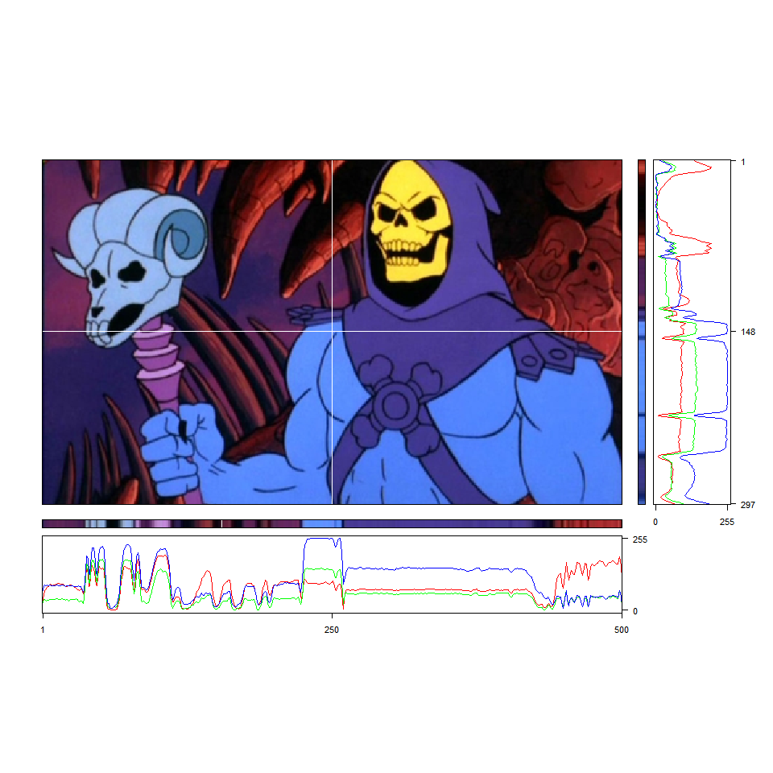

<!-- README.md is generated from README.Rmd. Please edit that file -->

# Image RGB profiles

-   **This is an EXPERIMENTAL piece of code that needs more work and
    testing**
-   I am no longer developing it, but wanted to share it here in case it
    provides a useful starting point for someone else…

``` r
library(tidyverse)
library(magick)
library(grid)
```

-   Read image and resize.
-   Convert to a raster dataframe in long format and add columns of red,
    green and blue pixel intensities.
    -   This is made very easy with the `magick` package.

``` r
i <-
  image_read('https://www.denofgeek.com/wp-content/uploads/2014/06/skeletor.jpg?fit=620%2C368') %>% 
  image_resize("500x") %>% 
  image_raster() %>% 
  mutate(col2rgb(col) %>% t() %>% as_tibble())
```

-   Store image width, height and aspect ratio for use later on

``` r
i_w <- max(i$x)
i_h <- max(i$y)
asp <- i_h/i_w
```

-   Define the vertical and horizontal test lines along which the rgb
    profiles are to be computed
    -   The hoirzontal and vertical midpoints

``` r
v <- round(i_w/2)
h <- round(i_h/2)
```

-   Create the plot of the resized image

``` r
main <-
  ggplot(i)+
  geom_raster(aes(x, y, fill=I(col)))+
  geom_vline(xintercept = v, col="white")+
  geom_hline(yintercept = h, col="white")+
  coord_equal()+
  scale_x_continuous(expand = expansion(0,0))+
  scale_y_reverse(expand = expansion(0,0))+
  theme_void()
```

-   Store the limits of the y axes to be -10 and 265 for the RGB profile
    plots. This will give some padding around the profile plots so that
    the border box doesn’t interfere with them.

``` r
rgb_scale <- c(-10, 265)
```

-   Create the vertical slice RGB profiles and their colours.

``` r
vert <-
  i %>% 
  filter(x == v) %>% 
  arrange(y) %>% 
  select(-x, -col) %>% 
  pivot_longer(-y) %>% 
  mutate(name = factor(name, levels = c("red", "green", "blue"))) %>% 
  ggplot()+
  geom_line(aes(y, value, col=I(name)))+
  scale_x_reverse(expand = expansion(0,0))+
  scale_y_continuous(expand = expansion(0,0), 
                     limits = rgb_scale)+
  coord_flip()+
  theme_void()+
  theme(legend.position = "")

vert_cols <-
  i %>% 
  filter(x == v) %>% 
  arrange(y) %>% 
  transmute(col = fct_inorder(col), x=1, y=1) %>% 
  ggplot()+
  geom_col(aes(x, y, fill=I(col), group=y))+
  scale_x_continuous(expand = expansion(0,0))+
  scale_y_reverse(expand = expansion(0,0))+
  theme_void()
```

-   Do the same for the horizontal slice

``` r
horiz <-
  i %>% 
  filter(y == h) %>% 
  arrange(x) %>% 
  select(-y, -col) %>% 
  pivot_longer(-x) %>%
  mutate(name = factor(name, levels = c("red", "green", "blue"))) %>% 
  ggplot()+
  geom_line(aes(x, value, col=I(name)))+
  scale_x_continuous(expand = expansion(0,0))+
  scale_y_continuous(expand = expansion(0,0),
                     limits = rgb_scale)+
  theme_void()+
  theme(legend.position = "")

horiz_cols <-
  i %>% 
  filter(y == h) %>% 
  arrange(x) %>% 
  transmute(col = fct_inorder(col),
            x = 1,
            y = 1) %>% 
  ggplot()+
  geom_col(aes(x, y, fill=I(col), group=x))+
  scale_x_continuous(expand = expansion(0,0))+
  scale_y_continuous(expand = expansion(0,0))+
  coord_flip()+
  theme_void()
```

-   Define the width parameters in Square Normalised Parent Coordinates
    (snpc) for the output plot

``` r
width <- 0.75
buffer <- 0.02
col_strip <- 0.01
vertical_strip <- 0.1
horizontal_strip <- 0.1
```

-   Draw all of the components

``` r
# Create and push the viewport with the correct grid layout 
grid.newpage()
pushViewport(
  viewport(
    width = unit(1, "snpc"),
    height = unit(1, "snpc"),
    layout=
      grid.layout(nrow = 5,
                  ncol = 5,
                  widths = unit(c(ifelse(i_w >= i_h, width, width/asp), 
                                  buffer, 
                                  col_strip,
                                  buffer/2,
                                  vertical_strip), "snpc"),
                  heights = unit(c(ifelse(i_w >= i_h, width*asp, width),
                                   buffer,
                                   col_strip,
                                   buffer/2,
                                   horizontal_strip), "snpc"))))

# Draw image ------------------------------------------------------------------
pushViewport(viewport(layout.pos.row = 1, layout.pos.col = 1))
grid.draw(ggplotGrob(main))
grid.rect(gp = gpar(fill=NA, col=1))
popViewport()

# Draw vertical RGB profile (RIGHT) -------------------------------------------
pushViewport(viewport(layout.pos.row = 1, 
                      layout.pos.col = 5,
                      yscale = c(i_h+0.5, 0.5), 
                      xscale = rgb_scale))

grid.draw(ggplotGrob(vert))
grid.xaxis(at = c(0, 255), gp=gpar(cex=0.7))
grid.yaxis(at = c(1, h, i_h), gp=gpar(cex=0.7), main=FALSE)
grid.rect(gp = gpar(fill=NA, col=1))
popViewport()

# Draw vertical colours (RIGHT) -----------------------------------------------
pushViewport(viewport(layout.pos.row = 1, layout.pos.col = 3))
grid.draw(ggplotGrob(vert_cols))
grid.rect(gp = gpar(fill=NA, col=1))
popViewport()

# Draw horizontal RGB profile (BOTTOM) ----------------------------------------
pushViewport(viewport(layout.pos.row = 5, 
                      layout.pos.col = 1, 
                      yscale = rgb_scale, 
                      xscale = c(0.5, i_w+0.5)))

grid.draw(ggplotGrob(horiz))
grid.yaxis(at = c(0, 255), main=FALSE, gp=gpar(cex=0.7))
grid.xaxis(at = c(1, v, i_w), gp=gpar(cex=0.7))
grid.rect(gp = gpar(fill=NA, col=1))
popViewport()

# Draw horizontal colours (BOTTOM) --------------------------------------------
pushViewport(viewport(layout.pos.row = 3, layout.pos.col = 1))
grid.draw(ggplotGrob(horiz_cols))
grid.rect(gp = gpar(fill=NA, col=1))
popViewport()
```

<!-- -->
